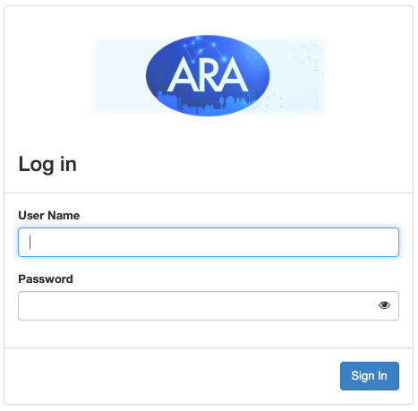
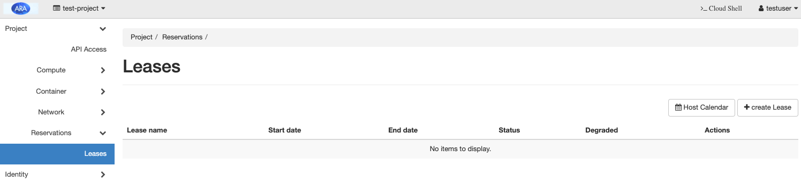

"Hello World!" in ARA
================================================

**Platform:** ARA Computing Server

**Resources Required:** Any server with compute capabilities

**Short Description:** The experiment demonstrates reserving an
ARA computing resource and launch a container in the reserved node.

**Detailed Description:** The "Hello World!" experiment in ARA is
intended to provide users the first experience of the infrastructure
on reserving and accessing a fundamental computing resource. ARA
provisions the resources using Docker containers and provides access to
the users for executing their experiments.

**Detailed Steps for the Experiment**

1. Access the login page and use the credentials to login.

 
2. To reserve an ARA compute resource, we need to create a lease for
   the resource. Click the *Leases* option under the *Project ->
   Reservations* tab in the dashboard.

3. Click on the *Create Lease* button on the top-right.  The user will
   be redirected to the *Create Lease* form for specifying the
   reservation specific attributes.

   a. In the tab **General**, you need to specify the following
      attributes:

        * *Lease Name*: User-given name for the lease.
        *  *Start Date*: The intended date (and time) of start of the lease.
        *  *End Date*: The intended time for ending the lease.

       .. image:: images/General_Tab.png
            :width: 600
            :align: center

   b. In the **Resources** tab, we need to select the following
      attributes of the resource.

         * *Site*: The site at which the resource resides. For compute
	   node, we need to select *Data Center*.
	 * *Resource Type*: Among the list of available resource types
	   in the drop-down menu, select the *Compute* type.
	 * *Device Type*: From the drop-down box, select *Compute Node*.

       .. image:: images/Resources_Tab.png
	    :width: 600
            :align: center 

   c. The *Wireless* tab is intended for RAN experiments. For compute
      nodes, we can ignore the fields in this section.

       .. image:: images/Wireless_Tab.png
	    :width: 600
            :align: center

       After specifying the lease parameters, click the *Create Lease*
       button at the bottom right to create the lease. It may take
       several minutes to activate the lease.

       .. image:: images/Lease_Activation.png
	    :width: 1000
            :align: center

   The created lease will be listed in the page and click on the created
   lease to see the information. A sample screenshot of a lease is
   shown below.

   .. image:: images/Lease_Details.png
        :width: 1000
        :align: center

  Remember to make a note of the *id* (starting with 1c9d... in the
  figure above) under the *Reservations* section since it is required
  during the container creation.

4. To create a container, select the *Containers* tab in the *Project
   -> Container* menu from the dashboard as shown in the following
   figure.

   .. image:: images/Containers_Tab.png
	:width: 1000
	:align: center

   | 

   a. Click the *Create Container* button at the top-right of the page.

      * In the *Info* tab, provide the general details of the
	container. For example:

	    * *Name*: Name of the container
	    * *Image*: Container image, say *ubuntu*. Please note that
	      a container image built with *ssh* service is
	      recommended for remote access.
	    * *Image Driver*: Select the container image source, say
	      Docker Hub (i.e., the image will be pulled from the
	      Docker Hub repository).
	    * *Command*: Provide the command to run when the container
	      is launched. For example, to get a command line
	      interface, we need to provide *bash* as the command.
	      
	.. image:: images/Container_Info_Tab.png
	     :width: 800
	     :align: center

      * In the Spec tab, you can provide the default values except for
	the *Lease ID* field, where you need to provide the ID
	matching with the *reservation ID* noted during the lease
	creation. In this example, the *Lease ID* should be
	*blazar_1c9d...*. 

	.. image:: images/Container_Spec_Tab.png
	     :width: 800
             :align: center

      * In the *Networks* tab, select the network, which is mandatory
	for any container creation. 

	.. image:: images/Container_Networks_Tab.png
	     :width: 800
	     :align: center

      * Click the *Create* button for creating the container. The
        status of created container is as follows:

	    .. image:: images/Container_Running.png
		 :width: 1000
		 :align: center

      * Clicking on the container shows the properties of the
	container such as name, host, and IP address.
	    
	     .. image:: images/Container_Info.png
		 :width: 1000
		 :align: center

       * The *Console* tab on the top may direct you to the shell of
	 the container where you can run the experiment. Please note
	 that the console may not be available in some browsers due to
	 plugin restrictions. In such cases, the container can be
	 accessed using floating point IPs.

	 .. image:: images/Container_Shell.png
	      :width: 1000
	      :align: center       

5. When the container is in the *running* state, we can assign
   floating IP address to it. Select *Floating IP* tab of the *Project
   -> Network* menu from the dashboard and click on the *Allocate IP
   to the Project* button.

   .. image:: images/Allocate_IP_to_Project.png
        :width: 1000
	:align: center

   In the sub-window as shown below, click and click the *Allocate IP*
   button with default settings.

   .. image:: images/Manage_Floating_IP.png
        :width: 600
	:align: center

   The allocation reserves an IP for the project which can be assigned
   to the container for accessing it from outside. For associating the
   floating IP to the container, click the *Associate* button in the
   following figure.

   .. image:: images/Associate_Floating_IP.png
      :width: 1000
      :align: center

   In the sub-window as shown below, select the *Port to be
   associated* option as the IP address of your container available
   from the container information.

   .. image:: images/Associate_Floating_IP_1.png
        :width: 600
	:align: center

6. When the association is active, we can use the IP to ssh into the
   controller from the ARA-jumpbox.

   * First login to the ARA Jumpbox using the username given. For
     example, for the username *johndoe*, you can login to the jumpbox
     using the following command from your computer terminal.

     ``ssh johndoe@jbox.arawireless.org``

   * Next login to the container with the floating point IP
     assigned. For the example, you can use the following command to
     login to the container.

     ``ssh root@10.189.9.65``
