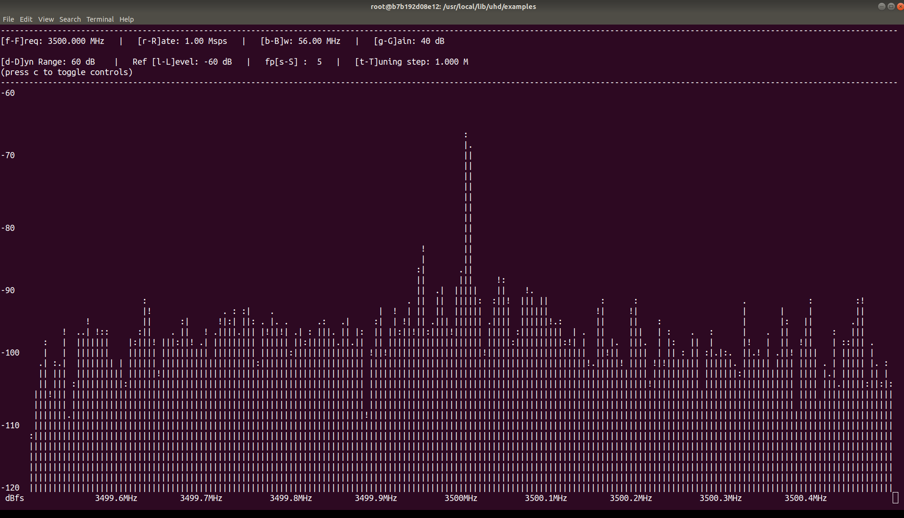

AraRAN Experiments
=========================


Experiment 1 - Transmitting, Receiving, and Visualizing Waveforms using UHD and GNURadio
--------------------------------------------------------------------------------------------------

**Platform:** Universal Software Radio Peripheral.

**Resources needed:** USRP N320, USRP B210, and a general purpose server.

**Short Description:** Transmit and receive samples to a file using
 USRP Hardware Driver (UHD) and GNU Radio.

**Detailed Description:** The experiment makes use of UHD and GNU
Radio to transmit signals from the base station, receive, visualize,
and save the IQ samples to a file for analysis.

Follow the steps below to create leases and launch containers for this experiment:

1. Login to the portal ``portal.arawireless.org`` with your username
   and password.
2. Create two reservations using the *Project -> Reservations -> Leases* tab from the dashboard:

      1. gNB

	 * *Site*: Sandbox  
	 * *Resource Type*: AraRAN  
	 * *Device Type*: Base Station

      2. UE

	 * *Site*: Sandbox
	 * *Resource Type*: AraRAN
	 * *Device Type*: User Equipment


3. Create two containers on the respective nodes using the corresponding reservation IDs. 
   For the containers, the Docker images can be used as follows:

      1. gNB

	 * *Container Image*: ``aravisor/container_images:gNodeB``

      2. UE

	 * *Container Image*: ``aravisor/container_images:nrUE``

      (Note that these container images have been equipped with USRP Hardware Driver already)

4. Once the container is launched, associate a floating IP with the
   container.

5. Associate floating IPs with the containers using the *Project ->
   Network -> Floating IPs* tab.

6. The containers can be accessed via the console tab of the
   respective containers in the *Project -> Containers* tab from the
   dashboard or using ssh via the jumpbox server.


3. In the gNB container, run the following commands to transmit a
   sample waveform with specific frequency, sampling rate, bandwidth,
   and gain. ::

	cd /usr/local/lib/uhd/examples
	./tx_waveforms --freq 3500e6 --rate 5e6 --gain 0

The output from the tx_waveforms is as follows: ::

	Creating the usrp device with: ...
	[INFO] [UHD] linux; GNU C++ version 7.5.0; Boost_106501; UHD_4.0.0.HEAD-0-g90ce6062
	[INFO] [MPMD] Initializing 1 device(s) in parallel with args: mgmt_addr=192.168.20.2,type=n3xx,product=n320,serial=32584FD,claimed=False,addr=192.168.20.2
	[INFO] [MPM.PeriphManager] init() called with device args `mgmt_addr=192.168.20.2,product=n320,clock_source=gpsdo,time_source=gpsdo'.
	[INFO] [MPM.Rhodium-0] init() called with args `mgmt_addr=192.168.20.2,product=n320,clock_source=gpsdo,time_source=gpsdo'
	[INFO] [MPM.Rhodium-1] init() called with args `mgmt_addr=192.168.20.2,product=n320,clock_source=gpsdo,time_source=gpsdo'
	[INFO] [MPM.Rhodium-0] Re-initializing daughter board. This may take some time.
	[INFO] [MPM.Rhodium-0] init() called with args `mgmt_addr=192.168.20.2,product=n320,clock_source=internal,time_source=internal,skip_rfic=None,master_clock_rate=245760000.0,ref_clk_freq=25000000.0'
	[INFO] [MPM.Rhodium-0.init.LMK04828] LMK initialized and locked!
	[INFO] [MPM.Rhodium-0.DAC37J82] DAC PLL Locked!
	[INFO] [MPM.Rhodium-0.AD9695] ADC PLL Locked!
	[INFO] [MPM.Rhodium-0.init] JESD204B Link Initialization & Training Complete
	[INFO] [MPM.Rhodium-1] Re-initializing daughter board. This may take some time.
	[INFO] [MPM.Rhodium-1] init() called with args `mgmt_addr=192.168.20.2,product=n320,clock_source=internal,time_source=internal,skip_rfic=None,master_clock_rate=245760000.0,ref_clk_freq=25000000.0'
	[INFO] [MPM.Rhodium-1.init.LMK04828] LMK initialized and locked!
	Using Device: Single USRP:
	  Device: N300-Series Device
	  Mboard 0: n320
	  RX Channel: 0
	    RX DSP: 0
	    RX Dboard: A
	    RX Subdev: Rhodium
	  RX Channel: 1
	    RX DSP: 1
	    RX Dboard: B
	    RX Subdev: Rhodium
	  TX Channel: 0
	    TX DSP: 0
	    TX Dboard: A
	    TX Subdev: Rhodium
	  TX Channel: 1
	    TX DSP: 1
	    TX Dboard: B
	    TX Subdev: Rhodium

	Setting TX Rate: 1.000000 Msps...
	Actual TX Rate: 0.999024 Msps...

	Setting TX Freq: 3500.000000 MHz...
	Setting TX LO Offset: 0.000000 MHz...
	Actual TX Freq: 3500.000000 MHz...

	Setting TX Gain: 0.000000 dB...
	Actual TX Gain: 0.000000 dB...

	[INFO] [MPM.Rhodium-1.DAC37J82] DAC PLL Locked!
	[INFO] [MPM.Rhodium-1.AD9695] ADC PLL Locked!
	[INFO] [MPM.Rhodium-1.init] JESD204B Link Initialization & Training Complete
	[WARNING] [0/Radio#0] Attempting to set tick rate to 0. Skipping.
	Setting device timestamp to 0...
	Checking TX: all_los: locked ...
	Press Ctrl + C to stop streaming...
	^C
	Done!


4. To visualize the DFT/FFT of the waveform generated in Step 3, run
   the following command in the UE container; ::

	cd /usr/local/lib/uhd/examples
	./rx_ascii_art_dft --freq 3500e6 --rate 1e6 --gain 40 --ref-lvl -60

5. The terminal displays DFT/FFT as in the figure below when we run
   ``rx_ascii_art_dft``;



**Note**: You can change the properties of the waveform to suit your
 preference. Moreover, you can transmit an OFDM signal/waveform such
 as the one from the OAI nrsoftmodem.

6. To save the IQ samples to a file for further processing, run the
   following command in the UE container; ::

	cd /usr/local/lib/uhd/examples
	./rx_samples_to_file --freq 3500e6 --rate 1e6 --gain 40 --duration 15 IQ_samples.dat

7. The output from ``rx_samples_to_file`` is as follows: ::

	Creating the usrp device with: ...
	[INFO] [UHD] linux; GNU C++ version 7.5.0; Boost_106501; UHD_4.2.0.HEAD-0-g46a70d85
	[INFO] [B200] Detected Device: B210
	[INFO] [B200] Operating over USB 3.
	[INFO] [B200] Initialize CODEC control...
	[INFO] [B200] Initialize Radio control...
	[INFO] [B200] Performing register loopback test... 
	[INFO] [B200] Register loopback test passed
	[INFO] [B200] Performing register loopback test... 
	[INFO] [B200] Register loopback test passed
	[INFO] [B200] Setting master clock rate selection to 'automatic'.
	[INFO] [B200] Asking for clock rate 16.000000 MHz... 
	[INFO] [B200] Actually got clock rate 16.000000 MHz.
	Using Device: Single USRP:
	  Device: B-Series Device
	  Mboard 0: B210
	  RX Channel: 0
	    RX DSP: 0
	    RX Dboard: A
	    RX Subdev: FE-RX2
	  RX Channel: 1
	    RX DSP: 1
	    RX Dboard: A
	    RX Subdev: FE-RX1
	  TX Channel: 0
	    TX DSP: 0
	    TX Dboard: A
	    TX Subdev: FE-TX2
	  TX Channel: 1
	    TX DSP: 1
	    TX Dboard: A
	    TX Subdev: FE-TX1

	Setting RX Rate: 1.000000 Msps...
	[INFO] [B200] Asking for clock rate 32.000000 MHz... 
	[INFO] [B200] Actually got clock rate 32.000000 MHz.
	Actual RX Rate: 1.000000 Msps...

	Setting RX Freq: 3500.000000 MHz...
	Setting RX LO Offset: 0.000000 MHz...
	Actual RX Freq: 3500.000000 MHz...

	Setting RX Gain: 40.000000 dB...
	Actual RX Gain: 40.000000 dB...

	Waiting for "lo_locked": ++++++++++ locked.

	Press Ctrl + C to stop streaming...
	^C
	Done!
	
8. Check the size of your IQ file using the command below ::

	$ ls -al IQ_samples.dat
	-rw-r--r-- 1 root root 25720000 Feb 12 23:11 IQ_samples.dat


..
   Experiment 2 - End-to-End 5G Standalone OpenAirInterface5g using USRPs
   ---------------------------------------------------------------------------

   **Platform:** Universal Software Radio Peripheral.

   **Resources needed:** USRP N320, USRP B210, and general purpose host servers.

   **Short Description:** The experiment demonstrates a basic end-to-end
   5G network using OpenAirInterface5g and USRPs. The setup includes an
   OAI Core Network, gNB, and nrUE.

   **Detailed Description:** This experiment features a 5G network
   deployment using containerized 5G software components of
   OpenAirInterface5g, i.e., a containerized gNB, a containerized UE, and
   a containerized core network deployed in Intel x86 servers. The server
   hosting gNB is connected to an N320 SDR via single mode fiber
   fronthaul with 10G transceivers. On the other hand, the nrUE container
   also runs on a general purpose Intel x86 server which is connected to
   the USRP B210 SDR via a USB 3.0 cable. The gNB and CN are connected
   via a high-speed fiber backhaul to the data center. The following
   figure shows the 5G network created from the experiment.

   .. image:: images/E2E_5G_SA_OAI.png
      :align: center

   **Detailed Steps for the Experiment**

   1. Login to the portal ``portal.arawireless.org`` with your username
      and password.
   2. Create two reservations using the *Project -> Reservations ->
      Leases* tab from the dashboard:

      1. gNB

	 * *Site*: Sandbox  
	 * *Resource Type*: AraRAN  
	 * *Device Type*: Base Station

      2. UE

	 * *Site*: Sandbox
	 * *Resource Type*: AraRAN
	 * *Device Type*: User Equipment


   3. Create two containers on the respective nodes using the
      corresponding reservation IDs. For the containers, the Docker
      images can be used as follows:

      1. gNB

	 * *Container Image*: ``aravisor/container_images:gNodeB``

      2. UE

	 * *Container Image*: ``aravisor/container_images:nrUE``

      (Note that the gNB has already been connected to the OAI
      minimalistic Core Network deployment with the IP forwarding rules
      already enabled for seamless packet exchange between CN and gNB.)

   4. Once the container is launched, associate a floating IP with the
      container.

   5. Associate floating IPs with the containers using the *Project ->
      Network -> Floating IPs* tab.

   6. The containers can be accessed via the console tab of the
      respective containers in the *Project -> Containers* tab from the
      dashboard or using ssh via the jumpbox server.

   7. Run the OAI gNB using the following commands. ::

	   cd ~/openairinterface5g
	   source oaienv
	   cd cmake_targets/ran_build/build
	   ./nr-softmodem -O ../../../targets/PROJECTS/GENERIC-NR-5GC/CONF gnb.sa.band78.fr1.106PRB.usrpb210.conf --sa 

   8. From the OAI gNB server, ssh into the OAI CN to check the
      connection between the gNB and AMF using the following commands. ::

	   ssh cn@192.168.70.126
	   sudo docker logs oai-amf

   9. The packet exchanges between gNB and CN can be checked using the
      following command on the CN server. ::

	   tcpdump -i eno1

   10. Run the OAI nrUE using the following commands in the UE container. ::

	   cd ~/openairinterface5g
	   source oaienv
	   cd cmake_targets/ran_build/build
	   ./nr-uesoftmodem -r 106 --numerology 1 --band 78 -C 3619200000 --nokrnmod --ue-fo-compensation --sa -E --clock-source  2 --time-source 2

       Now the nrUE will be connected to the OAI CN and obtain an
       interface named as *oaitun_ue1* with an IP address, say
       ``12.1.1.x``, from SMF.

   11. Add the following route on the CN host server using the following
       command to enable communication to the UE from the CN via the
       interface *demo-oai*.::

	   ip route add 12.1.1.0/24 via 192.168.70.134 dev demo-oai

   12. Ping the UE using the IP address of the *oaitun_ue1* on the nrUE
       host by running the following command. ::

	   ping 12.1.1.x

   13. Similar to Step 10, to verify the reachability of the CN SMF from
       the UE, add a default route on the UE host as follows: ::

	   route add default gw 12.1.1.x
	   ping 192.168.70.134


   **Advanced Configurations**

   In order to achieve a stable end-to-end experiment on the experimental
   USRP platforms, we need to set advanced configuration as follows:

   1. On the gNB, make sure that the MTU of the N320 interface it set to
      9000 and the respective required ring buffer size.

   2. Run the following commands before you start the gNB ::

	   sudo sysctl -w net.core.wmem_max=62500000
	   sudo sysctl -w net.core.rmem_max=62500000
	   sudo sysctl -w net.core.wmem_default=62500000
	   sudo sysctl -w net.core.rmem_default=62500000
	   sudo ethtool -G eno12429 tx 4096 rx 4096


   **Note**: Currently, Experiment 1 can be performed in the sandbox. The OAI nrUE has inconsistencies while connecting to OAI CN in outdoor settings. The outdoor experiment readiness is in progress and will be updated soon.


Experiment 2: Monitoring Skylark MIMO Wireless link Performance
-----------------------------------------------------------------------

**Platform:** Skylark 

**Resources needed:** Central Unit (CU), Distributed Unit (DU), Radio
Unit (RU), and a Customer Premises Equipment (CPE)/User Equipment (UE)

**Short Description:** The experiment is designed to monitor wireless
 link parameters.

**Detailed Description:** In ARA platform, multiple CPEs are deployed
and are already connected to the ARA Skylark Base Station (BS). Using
the experiment, we can launch a container equipped with APIs to
interact with Skylark CU and measure real-time link utilization and
performance-related metrics on the Skylark platform. The figure below
shows the detailed network and experient diagram.

.. image:: images/Skylark_Experiment_1.png
   :align: center

**Detailed Steps**

1. Login to the portal ``portal.arawireless.org`` with your username
   and password.

2. Create a reservations using the *Project -> Reservations ->
   Leases* tab from the dashboard with the following attributes:

      * *Site*: Data Center  
      * *Resource Type*: Compute Node  
      * *Device Type*: Compute Node


3. Launch a container equipped with APIs using the container image
   ```arasklk/ara-sklk:sklk-api_v0.3```.

4. Associate floating IPs with the containers using the *Project ->
   Network -> Floating IPs* tab.

5. The containers can be accessed via the console tab of the
   respective containers in the *Project -> Containers* tab from the
   dashboard or using ssh via the jumpbox server.

6. Run the following script in the container to launch the CLI.  ::

    ./ara-sklk-cli.py

7. Run the following command to get the number of CPEs connected, SNR,
   and the average MCS being in effect. The information provides an
   idea about current system performance.  ::

    get_ue_stats

   Type ```help -v``` to show all the commands that can be run to
   extract wireless link data such as SNR, throughput etc. Here are
   the list of commands that can be run.  ::

    get_bus_rates        Print a table of bus rates
    get_center_freq      Gets center frequency
    get_config           Get current ue's configuration
    get_connected_ues    Returns a list of connected ues
    get_csi_data         Returns csi data
    get_data_rates       Print a table of data rates
    get_main_stats       Returns main statistics
    get_phy_config       Returns phy configuration
    get_ue_stats         Print current ue's statistics


..

   ..
      Experiment 4
      -------------------

      **Platform:** Ericsson and Quectel 

      **Resources needed:** CN, BBU, AAU, and two CPE/UE 

      **Short Description 1:** TCP uploading/downloading between two Quectel
      UEs (Q-UE), which connected with one Ericsson gNB (E-gNB) using
      mid-band/mmWave frequencies.  Detailed Description: Connect the two
      Q-UEs to the E-gNB (may NRDC); Run a TCP transmission between the 2
      Q-UEs; To check the throughput, based on mid-band UP, and mm-Wave UP.

      **Short Description 2:** verify different beamforming settings of
      physical channels.  

      **Detailed Description 2:** configure different BF parameters, reference
       signal settings, demodulated channel configurations. Compare the
       performance in link and service: Connect the two Q-UEs to the E-gNB
       (may NRDC); Get the measurements of different configurations. Run a
       TCP transmission between the 2 Q-UEs; To check the throughput, based
       on mid-band UP, and mm-Wave UP.


..
   Experiment 5
   --------------------

   **Platform:** Skylark 

   **Resources needed:** CU, DU, RU and one CPE/UE 

   **Short Description:** User grouping and scheduling with Skylark mMIMO 

   **Detailed Description:** Multiple CPEs are connected to Skylark
   BS. Multiple users are scheduled simultanuously for transmission with
   multi user beamforming. The experiment demonstrates how the number of
   user groups can be modified and its effect on real time performance
   such as throughput, latency, capacity etc.The experiment also
   demonstrates the performance difference between single user
   beam-forming and multi user beam-forming.


